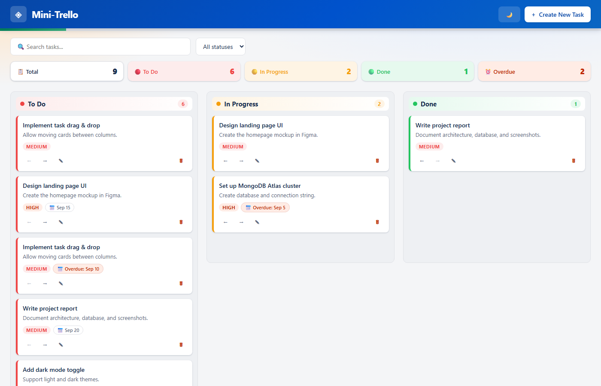
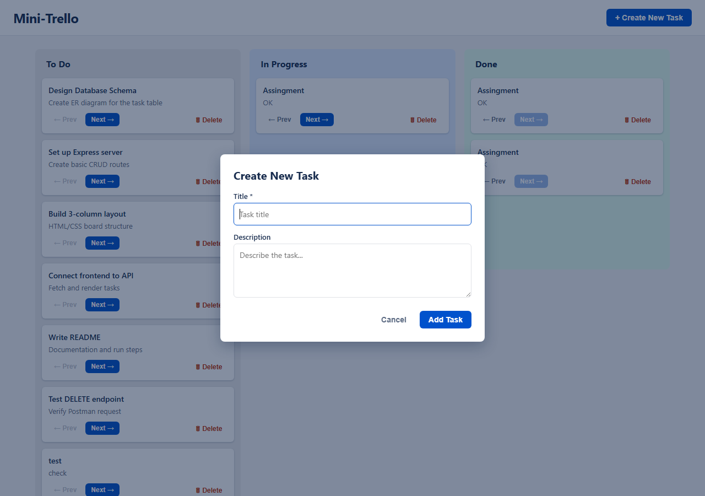

# ◈ Mini-Trello

**A modern, cloud-powered Kanban board** that makes it effortless to plan, track, and complete work.
Create tasks, drag them across **To Do → In Progress → Done**, and keep everything visual — just like Trello, but built from scratch.

Built as a live `Full-Stack Mini Project` with a real REST API and a cloud database.

## 🚀 Live Demo

👉 **[mini-trello-fagf.onrender.com](https://mini-trello-fagf.onrender.com)**

> The app is deployed live on Render — open the link and try it right now!

---

## 🎯 At a Glance

| What | Where |
| ---- | ---- |
| **Frontend** | HTML5 · CSS3 · Vanilla JavaScript |
| **Backend** | Node.js · Express |
| **Database** | MongoDB Atlas (cloud) |
| **Hosted API** | Render (free tier) |
| **Methodology** | Agile — 3 short sprints |

---

## ✨ Key Features

| Feature | What it does |
| ------- | ------------ |
| **3-column Kanban board** | To Do · In Progress · Done with live counts |
| **Create / Edit / Delete** | Full task lifecycle with an elegant form modal |
| **Drag & Drop** | Move cards between columns naturally |
| **Quick move buttons** | ← / → arrows on every card as an alternative |
| **Priority levels** | Low · Medium · High color-coded on each card |
| **Due dates & overdue alerts** | Automatic ⏰ highlighting of overdue tasks |
| **Live stats panel** | Total, per-column, and overdue counters |
| **Progress bar** | Shows completion % at a glance |
| **Search + Filter** | Instant title/description search & status filter |
| **Dark / Light mode** | Theme toggle with saved preference |
| **Fully responsive UI** | Works on desktop, tablet, and mobile |
| **REST API** | Clean, documented HTTP endpoints for every action |

---

## 🖥️ Screenshots

### Main Board


### Create Task Modal


---

## 🚀 Getting Started

### Prerequisites
- [Node.js](https://nodejs.org) **22+**
- A **MongoDB Atlas** account with a free cluster

### Setup (4 easy steps)

**1. Install dependencies**
```bash
npm install
```

**2. Configure the database**
Copy the template file and fill in your own MongoDB connection string (the project keeps all credentials out of the code):
```bash
copy .env.example .env
```
```
MONGODB_URI=mongodb+srv://<your-user>:<your-password>@<your-cluster>.<your-id>.mongodb.net
MONGODB_DB=Mini-Trello
```

**3. Start the server**
```bash
npm start
```

**4. Open the app**
```
http://localhost:3000
```

> The server reads its configuration from environment variables only. Secret credentials are never hard-coded.

---

## 🔌 REST API

| Method | Endpoint         | Description                    |
| ------ | ---------------- | ------------------------------ |
| `GET`    | `/api/tasks`       | Fetch all tasks                |
| `POST`   | `/api/tasks`       | Create a task (goes to To Do)  |
| `PATCH`  | `/api/tasks/:id`   | Update status / title / more   |
| `PUT`    | `/api/tasks/:id`   | Replace a task's fields        |
| `DELETE` | `/api/tasks/:id`   | Delete a task                  |

**Example — create a task:**
```http
POST /api/tasks
Content-Type: application/json
```
```json
{
  "title": "Design landing page UI",
  "description": "Create the homepage mockup in Figma.",
  "priority": "high",
  "due_date": "2026-09-15"
}
```
```json
{
  "id": "6aa6d5bc49d5415e158546ac",
  "title": "Design landing page UI",
  "description": "Create the homepage mockup in Figma.",
  "status": "todo",
  "priority": "high",
  "due_date": "2026-09-15"
}
```

---

## 📁 Project Structure

```
mini-trello/
├── server/
│   ├── server.js        # Express app + REST API routes
│   └── db.js            # MongoDB connection layer
├── public/
│   ├── index.html       # Single-page UI
│   ├── css/styles.css   # Styling + dark mode
│   └── js/app.js        # Frontend logic + API calls
├── screenshots/         # App screenshots for the report
├── scripts/             # Report generation helper
├── .env.example         # Environment template (no secrets)
├── render.yaml          # Render blueprint
├── package.json
└── README.md
```

---

## 🗓️ Agile Execution

The project was built in three short sprints using the **Agile/Scrum** methodology:

| Sprint | Scope | Delivered |
| ------ | ----- | --------- |
| **Sprint 1 — Foundation** | Server, database, core routes | Express server + MongoDB connection + Create/Read + 3-column board |
| **Sprint 2 — Integration** | Actions + live UI | Update/Delete routes, drag & drop, instant UI refresh |
| **Sprint 3 — UX Polish** | Power features | Search & filter, priorities, due dates, stats, dark mode, responsive design |

---

## 🌐 Deployment Notes

The project is designed to deploy easily on a cloud platform like **[Render](https://render.com)**:

1. Push the repository to GitHub.
2. Create a **New Web Service** in Render and connect the repo.
3. Set two environment variables: `MONGODB_URI` and `MONGODB_DB` (via the dashboard — never in the repo).
4. Allow cloud connections in **Atlas → Network Access** (`0.0.0.0/0`).
5. Deploy — Render builds and starts the app automatically.

The included `render.yaml` blueprint makes this a one-click setup.

**▶️ The project is already live at:** https://mini-trello-fagf.onrender.com

---

## 🧑‍🎓 Student

**Kirankumar Thakor** — *7th Semester, Mini Project*
Enrollment No. **230390116028**

---

*Built with Node.js, Express, MongoDB Atlas & a little bit of love.*